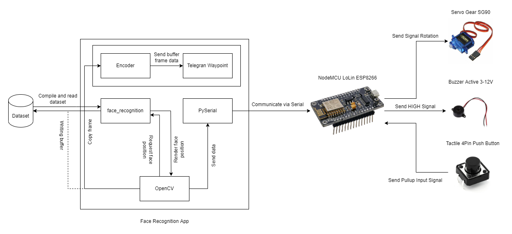

# Pengunci Pintu Otomatis Menggunakan Deteksi Wajah
Projek ini merupakan prototipe penguncian pintu otomatis menggunakan deteksi wajah sebagai kunci untuk membuka pintu.

Harap dibaca [peringatan](#disclaimer) di bawah sebelum mengambil aplikasi ini sebagai sampel penelitian.

Video demo bisa dilihat [di sini](https://www.youtube.com/watch?v=pn_35tyxcB4).

## Stacks
- Python 3.10.x
- Arduino NodeMCU ESP8266 LoLin

## Dependency (Arduino)
- [ESP8266 Board Library](https://github.com/esp8266/Arduino)
- [Arduino Servo Library](https://github.com/arduino-libraries/Servo)

## Dependency (Python)
- [OpenCV2 Contributor Edition](https://github.com/opencv/opencv_contrib)
- [Adam Geitgey's DLIB Face Recognition](https://github.com/ageitgey/face_recognition)
- [pyserial](https://github.com/pyserial/pyserial)
- [NumPy](https://github.com/numpy/numpy)
- [Python Decouple](https://github.com/HBNetwork/python-decouple)

## How It Works?

### Arduino
Arduino hanya menerima data dari aplikasi deteksi muka berupa data `uint32` dari Serial Communication yang mana akan diteruskan ke Servo yang bekerja sebagai engsel otomatis dari pintu.

Adapun buzzer di sini digunakan sebagai pemanis/penanda dari setiap aksi yang dilakukan entah ada penyusup, menerima ping dari aplikasi, ataupun membuka pintu.

Push Button di sini digunakan untuk membuka pintu secara manual. Diibaratkan sebagai "pegangan pintu manual" di sisi lain dari ruangan.

### Face Recognition App
OpenCV dan face_recognition mempunyai banyak andil dalam proses ini. OpenCV digunakan sebagai alat bantu face_recognition untuk merender frame yang terjadi dari webcam yang mana setiap ada aksi akan dikirimkan ke PySerial.

face_recognition di sini digunakan untuk membaca dan membuat *encoded dataset* yang berbentuk NumPy Array. Library ini juga digunakan sebagai alat bantu untuk menentukan posisi kordinat muka pada webcam yang dikirim oleh OpenCV.

PySerial digunakan untuk mengirim data ke NodeMCU dengan frekuensi 9600 baud. Data yang dikirim hanya berkisar sekitar 8 bit saja untuk meningkatkan performa pengiriman data ke mikrokontroler.

Dikarenakan library requests dari Python melakukan blocking ke aplikasi yang berdampak aplikasi akan hang dikarenakan menunggu hasil upload gambar ke Telegram Endpoint, kegiatan requests dipisah menjadi satu Thread yang akan hangus apabila proses requests tersebut selesai sehingga tidak mengganggu proses deteksi muka. Pemisahan Thread juga berguna apabila terjadi massive upload dari aplikasi ini karena tidak mengganggu thread utama yang mana bertugas untuk mendeteksi muka.

## Pin Location (Arduino)
| Pin | GPI | Target |
|-----|-----|--------|
| D0 | GPIO 16 | Buzzer |
| D1 | GPIO 5 | Push Button (Input Pullup) |
| D2 | GPIO 4 | Servo |
| G | GND (Right) | Grounding Buzzer & Push Button |
| VIN | 5V | Powering Servo |
| G | GND (Left) | Grounding Servo |

## How to Use
1. Seperti biasa, rakit arduino [berdasarkan lokasi pin yang sudah disediakan](#pin-location-arduino).
2. Install seluruh dependensi untuk [Arduino](#dependency-arduino) dan [Python](#dependency-python).
3. Build dan Upload `./Engine` menggunakan Arduino IDE dengan konfigurasi beriut:
    - Board: NodeMCU v1.0 (ESP-12E Module) / LOLIN(WEMOS) D1 R1
    - USB COM: Sesuaikan dengan port komputer masing-masing
    - Target: `Engine.ino`
4. (Opsional/Worst Case) Semisal ada hal yang aneh terjadi setelah upload file ke Arduino, tekan Reset 1x. Ditandai dengan Servo bergetar dan Buzzer menyala sebentar.
5. Copy `.env.example` menjadi `.env` dan buat folder bernama `dataset`. Atau kalian bisa menggunakan command di bawah ini (khusus Linux):
```sh
cd ./FaceReg
cp .env.example .env
mkdir dataset
```
6. Masukkan muka anda dengan struktur folder di bawah ini:
```
├── dataset
│   ├── NamaOrang1
│   │   ├── 1.jpg
│   │   ├── 2.jpg
│   │   └── 3.jpg
│   └── NamaOrang2
│       ├── 1.jpg
│       ├── 2.jpg
│       └── 3.jpg
```
Jumlah foto yang dimasukkan tergantung foto yang anda gunakan, semakin banyak semakin bagus. Rekomendasi foto yang dimasukkan adalah minimal 3 foto dengan ekspersi berbeda-beda. Ekstensi file yang direkomendasikan adalah `.jpg` dan `.png`

7. Konfigurasi file `.env` yang dicopy tadi sesuai dengan kebutuhan.
8. Pastikan konteks direktori anda berada di folder `./FaceReg` dan jalankan aplikasi pendeteksi muka dengan command di bawah ini:
```sh
py main.py
```

### Arduino VSCode Fix
Kadang kala, error yang terjadi saat menggunakan Arduino IDE di VSCode itu adalah mereka tidak bisa membaca file `.ino` apabila filenya dipisah. Untuk memperbaikinya, cari file `.vscode/c_cpp_properties.json` kemudian tambahkan semua yang ada di bawah ini:
```json
// Cari objek di bawah ini
"forcedInclude": [
    .....,
    // Copy dan Paste semua line di bawah ini
    "${workspaceFolder}\\Engine\\animate.ino"
]
```

### Disclaimer
Aplikasi ini tidak bisa digunakan sebagai skripsi karena sudah didaftarkan sebagai judul Aplikasi Profesional dan TA Konsentrasi di Universtias Dipa Makassar.

*(C) 2022 - Ikramullah. Protected with Open Source License. All rights reserved.*
